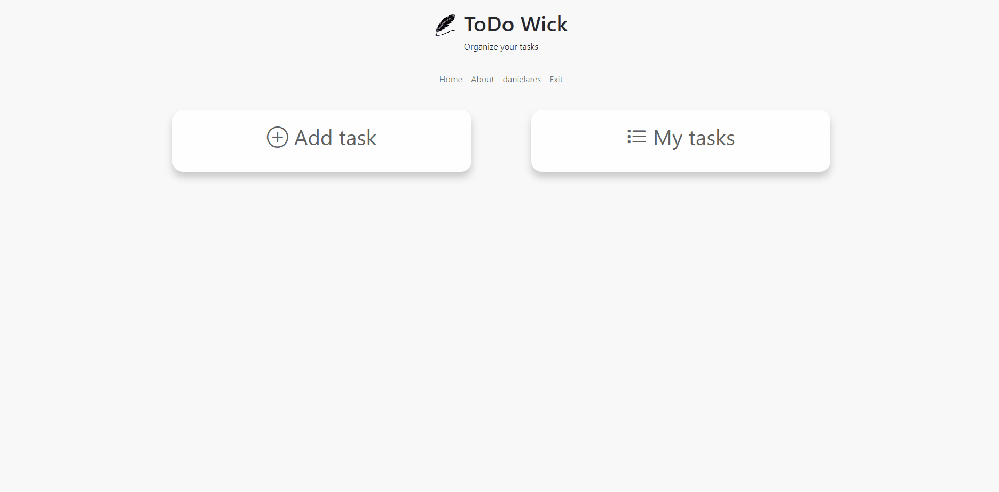

<h1 align='center'>ToDo Wick</h1>
<p align='center'>Application to help organize your tasks. Reminds you of your unfinished and overdue tasks.</p>

<p><a href='https://todo-wick.herokuapp.com'>Click here to see the application working</a></p>

<p align='center'>
<a href='#feature'>Features</a> |
<a href='#prerequisites'>Prerequisites</a> |
<a href='#prerequisites'>Running the Application</a> |
<a href='#prerequisites'>Technologies</a> |
<a href='#prerequisites'>Author</a> |
</p>
<hr>
<br>
<a href='https://todo-wick.herokuapp.com'>

</a>
<br>
<br>
<hr>

 ## Feature

- [x] Create new tasks.
- [x] Edit tasks.
- [x] Update tasks.
- [x] Delete tasks.
- [x] Show overdue tasks.


## Prerequisites

You need to install: <a href='https://git-scm.com/'>Git</a>, <a href='https://www.python.org/'>Python</a>.

You also you need an IDE like <a href='https://code.visualstudio.com/'>VSCode</a>

## Rodando a Aplicação
```bash
# Clone this repository
$ git clone https://github.com/danielares/TwComp
# Access the project folder in terminal/cmd
$ cd TwComp
# Install the dependencies
$ pip install -r requirements.txt
# Create a file called 'django_key.py' and enter your key in it (SECRET_KEY='YOUR KEY HERE')
# Run the application
python manage.py runserver
# Access the application at the address http://localhost:3000/
```

## Tecnologias
The following technologies below were used in the construction of the project:

- <a href='https://www.python.org/'>Python</a>
- <a href='https://www.djangoproject.com/'>Django</a>
- <a href='https://getbootstrap.com/'>Bootstrap</a>

<hr>

## Autor
Made by Daniel Ares 👋